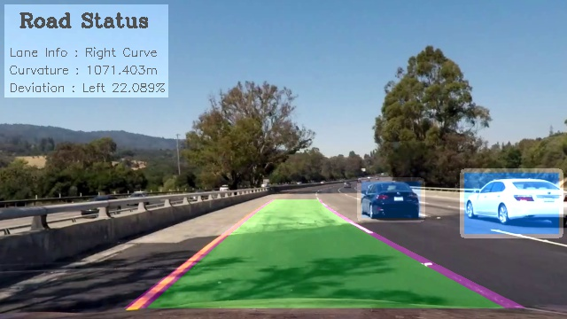
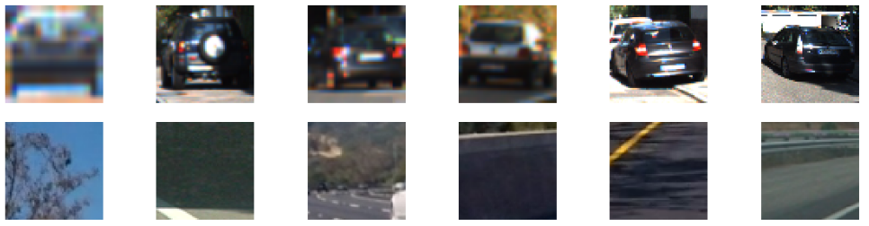
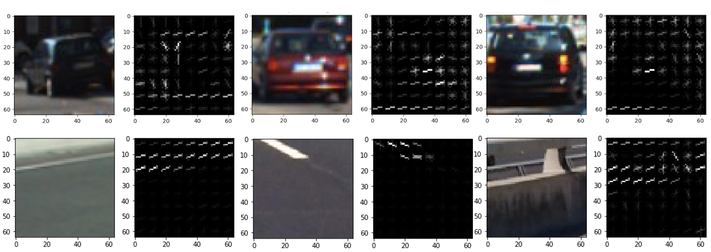
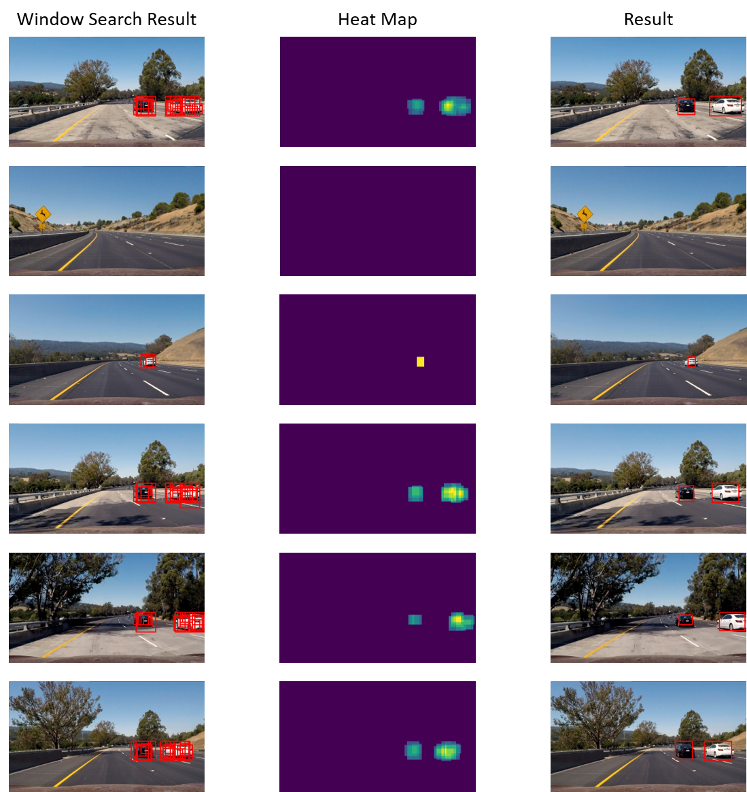
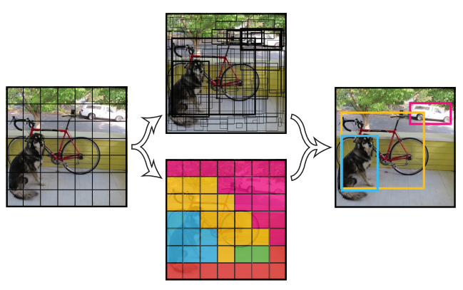
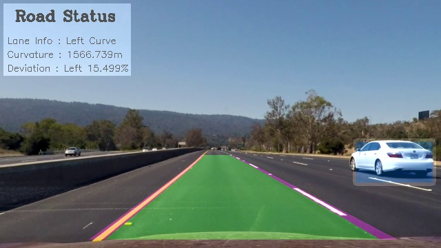

# Vehicle Detection(tiny YOLO ver, HOG & SVM ver )

<p align="center">
    <br>
    <b>result image(watch the full video below)</b><br>
</p>

## Introduction  
  
>This is **Vehicle Detection project** of Udacity's Self-Driving Car Engineering Nanodegree.
In this project, I approached with 2 methods for a vehicle detection. HOG + SVM approach and YOLO approach. In HOG + SVM approach, we classified vehicle using hog feature and color feature. And to search a position of vehicles, we implement a sliding window search. In YOLO approach, YOLO applies a single neural network to the full image.
  
## Environment  
  
#### software  
  
>Windows 10(x64), Python 3.5, OpenCV 3.1.0

#### hardware  
  
>CPU : i5-6500 3.20GHz, GPU : GTX 980Ti, Memory : 8GB  
  
## Files
  
> YOLO ver  
[`main.py`](main.py) : main code   
[`tiny.py`](tiny.py) : main code of tiny yolo   
[`yolo_small.py`](yolo_small.py) : yolo model composition  
[`yolo_tiny.py`](yolo_tiny.py) : tiny yolo model composition  
[`calibration.py`](calibration.py) : get calibration matrix  
[`threshold.py`](threshold.py) : sobel edge & hls color  
[`finding_lines.py`](finding_lines.py) : find & draw lane lines with sliding widow search  

  
> HOG + SVM ver  
[`main_hog.py`](main_hog.py) : main code   
[`svc_save.py`](svc_save.py) : extract feature & save SVM classifier result   
[`feature_extract.py`](feature_extract.py) : hog & color feature extraction  
[`find_car.py`](find_car.py) : sliding window search method   
[`svc_save.p`](svc_save.p) : saved SVM result   
---

## The goals / steps of this project are the following:

* Perform a Histogram of Oriented Gradients (HOG) feature extraction on a labeled training set of images and train a classifier Linear SVM classifier
* Optionally, you can also apply a color transform and append binned color features, as well as histograms of color, to your HOG feature vector. 
* Note: for those first two steps don't forget to normalize your features and randomize a selection for training and testing.
* Implement a sliding-window technique and use your trained classifier to search for vehicles in images.
* Run your pipeline on a video stream (start with the test_video.mp4 and later implement on full project_video.mp4) and create a heat map of recurring detections frame by frame to reject outliers and follow detected vehicles.
* Estimate a bounding box for vehicles detected.


---

### Dataset  
In this project, I used the labeled data for [vehicle](https://s3.amazonaws.com/udacity-sdc/Vehicle_Tracking/vehicles.zip) and [non-vehicle](https://s3.amazonaws.com/udacity-sdc/Vehicle_Tracking/non-vehicles.zip) examples to train your classifier.  These example images come from a combination of the [GTI vehicle image database](http://www.gti.ssr.upm.es/data/Vehicle_database.html), the [KITTI vision benchmark suite](http://www.cvlibs.net/datasets/kitti/).  
  
<p align="center">
  
</p>
  
### Histogram of Oriented Gradients (HOG)

#### HOG feature Extraction

The code for this step is contained in the [`feature_extract.py`](feature_extract.py) and [`save_svc.py`](save_svc.py)  
The histogram of oriented gradients (HOG) is a feature descriptor used in computer vision and image processing for the purpose of object detection. The technique counts occurrences of gradient orientation in localized portions of an image.  
  
This is my final choice of parameters of HOG  
```python
color_space = 'HLS'
spatial_size = (16, 16)
hist_bins = 32
orient = 9
pix_per_cell = 8
cell_per_block = 2
hog_channel = 'ALL'
spatial_feat = True
hist_feat = True
hog_feat = True
```

<p align="center">
  
</p>

#### Training a classifier

Extracted features using hog info & color info  
  
```python
car_features = extract_features(cars, color_space, spatial_size, hist_bins, orient, pix_per_cell,
                        cell_per_block, hog_channel, spatial_feat, hist_feat, hog_feat)
notcar_features = extract_features(notcars, color_space, spatial_size, hist_bins, orient, pix_per_cell,
                        cell_per_block, hog_channel, spatial_feat, hist_feat, hog_feat)
```  
  
To normalize a difference in magnitude between the color-based and gradient-based feature, I used StandardScaler() function of Python's sklearn package.  
  
```python
# Create an array stack of feature vectors
X = np.vstack((car_features, notcar_features)).astype(np.float64)
# Fit a per-column scaler
X_scaler = StandardScaler().fit(X)
# Apply the scaler to X
scaled_X = X_scaler.transform(X)
```  
  
Trained using  LinearSVM classifier  

```python  

# Split up data into randomized training and test sets
rand_state = np.random.randint(0, 100)
X_train, X_test, y_train, y_test = train_test_split(
    scaled_X, y, test_size=0.2, random_state=rand_state)

svc = LinearSVC()
svc.fit(X_train, y_train)
```  
  
And according to `svc.score(X_test, y_test)`, my Testest Accuracy was *0.9896*  

### Sliding Window Search  
  
The code for this step is contained in the [`find_car.py`](find_car.py) 
I used 3 square window sizes of 128x128, 96x96, 64x64 pixels size. And each adjacent sliding windows have an ovelap of 75%. Also  upper half of image and lower bonnet's position are ignored to search vehicles. Each windows check the Hog features and compared with SVM result.  
  
<p align="center">
  
</p>

### Heatmap  
  
During sliding window search, there are many false positives and Multiple Detections. To resolve this problem I used heatmap. Simply added "heat" (+=1) for all pixels within windows where a positive detection is reported by your classifier.  
  
This is my result of test images.  
  
<p align="center">
  
</p>

---

## Extra Works (YOLO & add Lane finding result)

### YOLO  
  
When I use a SVM + Hog method, the elapsed time for a vehicle detection was about *`4.28`* second per 1 frame. detection result was not bad but we never detect vehicles in real-time with 4.28s/frame. That's why I searched a YOLO. 
[YOLO](https://pjreddie.com/darknet/yolo/)(You Only Look it Once) is famous real-time object detection technique. Originally YOLO is codded with C language but I found a [tensorflow version of YOLO](https://github.com/gliese581gg/YOLO_tensorflow) and I revised it.  
My code does not support training. Used [darknet](https://pjreddie.com/darknet/yolo/)'s weight file. On average, I could get 0.035 second per 1 frame with YOLO_small(GPU : GTX 980Ti) and about *`0.025`* second per frame in tiny YOLO model.   
  
<p align="center">
  
</p>
  
Yolo's approach is really impressive. Prior detection systems(e.g. faster-R-CNN) apply the model to an image at multiple locations and scales. High scoring regions of the image are considered detections. but YOLO applies a single neural network to the full image. This network divides the image into regions and predicts bounding boxes and probabilities for each region. These bounding boxes are weighted by the predicted probabilities.  
To understand how yolo works, please watch this [youtube video](https://www.youtube.com/watch?v=L0tzmv--CGY). Language is Russian but you can understand easily.  
  
### Merge with Lane finding project  
  
By using YOLO, i could real-time detect vehicles in video. To check a real-time lane-finding & vehicle detection, I merged this project with [advanced lane finding project](https://github.com/windowsub0406/Advanced-lane-finding). This is the result.  

<p align="center">
  
</p>

## Result

<p align="center">
 <a href="https://youtu.be/quoWQc8F8PM"></a>
 <br>Final real-time Result (click for full video)
</p>


---

## Reflection

I could learn and implement SVM classifier and yolo. Before starting this project, I had decided to use a YOLO for vehicle detection because I was really interested in YOLO. But I did't have experience about SVM-based detection and wondered the result. That's why I used both methods in this project. SVM classifier could detect vehicle well but the elapsed time was terrible. To search a position of object, I needed to search almost every frame using sliding window search. But I could resolve it by using YOLO.  
In this project, I didn't retrain a model and used tiny YOLO. So, according to my result, it couldn't detect small vehicles and showed some of false positives. For a best result, I'll fine-tune yolo or ssd method to mine. That's my future work.